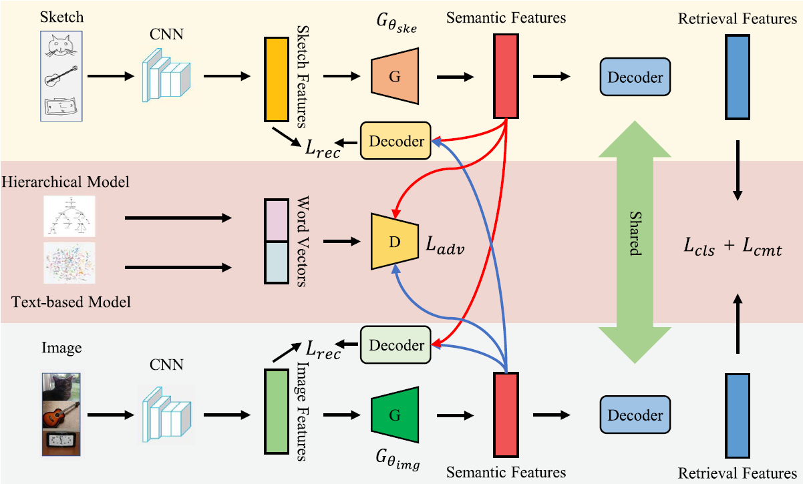

# Progressive Cross-Modal Semantic Network for Zero-Shot Sketch-Based Image Retrieval(TIP2020)

This project is our implementation of **Progressive Cross-Modal Semantic Network for
Zero-Shot Sketch-Based Image Retrieval** [[paper](https://ieeexplore.ieee.org/abstract/document/9194144)]



If you find this project helpful, please consider to cite our paper:

```
@article{deng2020progressive,
  title={Progressive cross-modal semantic network for zero-shot sketch-based image retrieval},
  author={Deng, Cheng and Xu, Xinxun and Wang, Hao and Yang, Muli and Tao, Dacheng},
  journal={IEEE Transactions on Image Processing},
  volume={29},
  pages={8892--8902},
  year={2020},
  publisher={IEEE}
}
```

## Dataset

We use Sketchy and TU-Berlin datasets for zero-shot SBIR, following the same zero-shot data partitioning in [SEMPCYC](https://arxiv.org/abs/1903.03372)

You can download the datasets from [here(passwd:xdXx)](https://pan.baidu.com/s/18TW1Qmwy8_HwP37AlYUdLQ). Then unzip it and put the contents in `./ZS-SBIR` of this project.


## Models

The model files can be downloaded from [here(passwd:qc22)](https://pan.baidu.com/s/1J25seAOhIYqAFdkAfQH7OQ). Then unzip and put it in `./model`.


## Training

TIP model with 64-d features in default setting

```python
# train with Sketchy Ext dataset
python ys_tip.py --dataset Sketchy

# train with TU-Berlin Ext dataset
python ys_tip.py --dataset TU-Berlin
```


## Testing

TIP model with 64-d features in default setting

```python
# test with Sketchy Ext dataset
python ys_tip.py --dataset Sketchy --test

# test with TU-Berlin Ext dataset
python ys_tip.py --dataset TU-Berlin --test
```


## Pre-trained Models

Our trained models for Skethy Ext and TU-Berlin Ext with 64-d features in default setting can be downloaded from [here(passwd:lo8p)](https://pan.baidu.com/s/168BnqEx1shUN-KmuSGli9Q). Please put the contents in `./checkpoint/`. 

For example, the path of pre-trained model for Sketchy Ext in default experimental setting should be:

`./checkpoint/tip_Sketchy_extended_None_hieremb-jcn+word2vec-google-news_c2f_False_64/model_best.pth`
